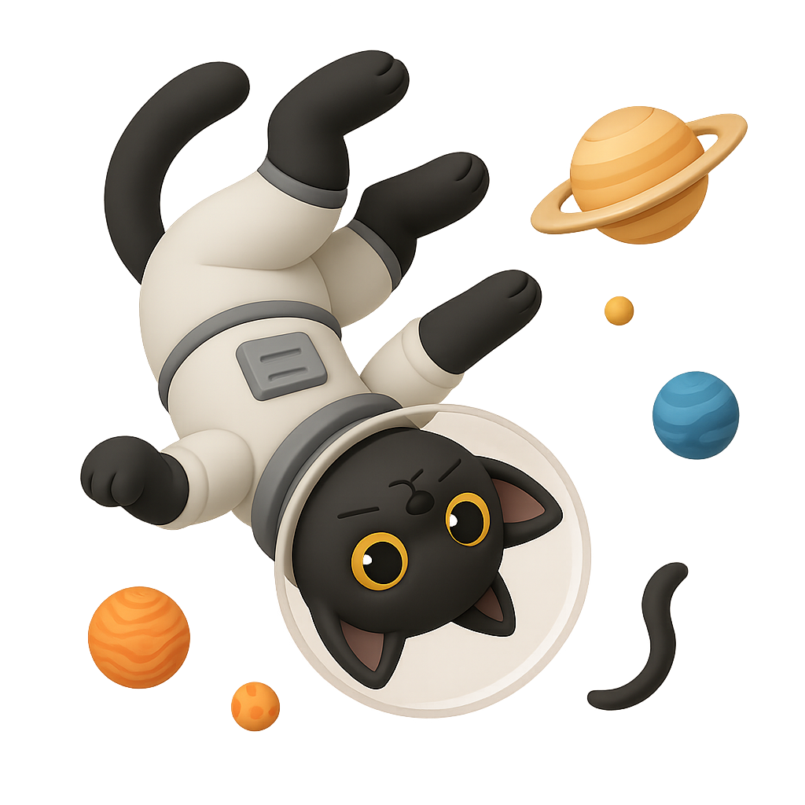
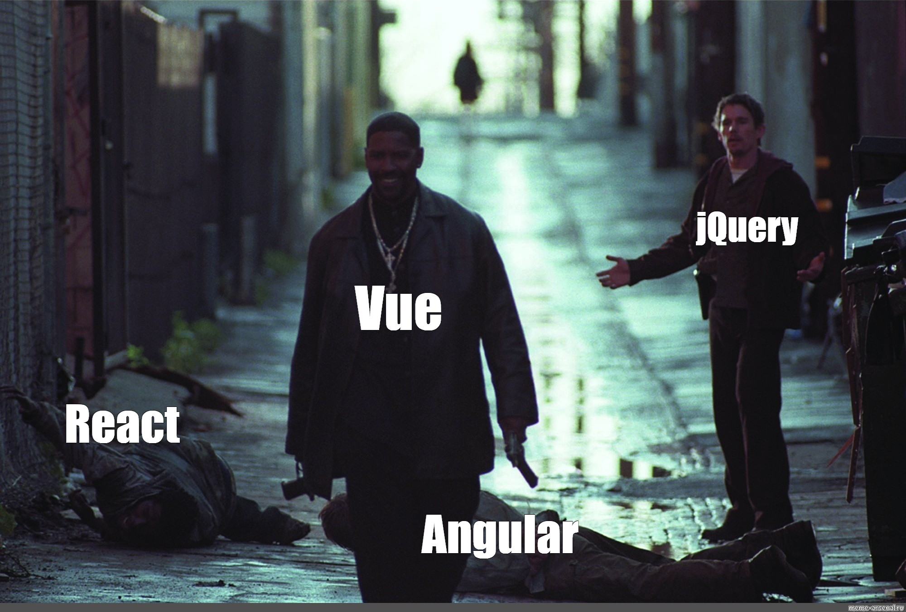

<p align="center">
  
</p>

<h1 align="center">Bio Links - Instagram</h1>

<p align="center">
  <a href="https://vuejs.org/" target="_blank">
    
  </a>
  <a href="https://vitejs.dev/" target="_blank">
    
  </a>
  <a href="https://vitejs.dev/" target="_blank">
    
  </a>
</p>

---

## About

**Bio Links** is a simple and customizable platform to manage and share your social and professional links in one place. Built with [Vue.js](https://vuejs.org/) and [Vite](https://vitejs.dev/).

## Features

- Modern Vue 3 + TypeScript stack
- Fast development with Vite
- Responsive and customizable UI
- Easy link management

## Getting Started

```bash
git clone https://github.com/fdhliakbar-links/fdhliakbar-links.git

npm install

npm run dev
```

---

<div align="center">
  
</div>
